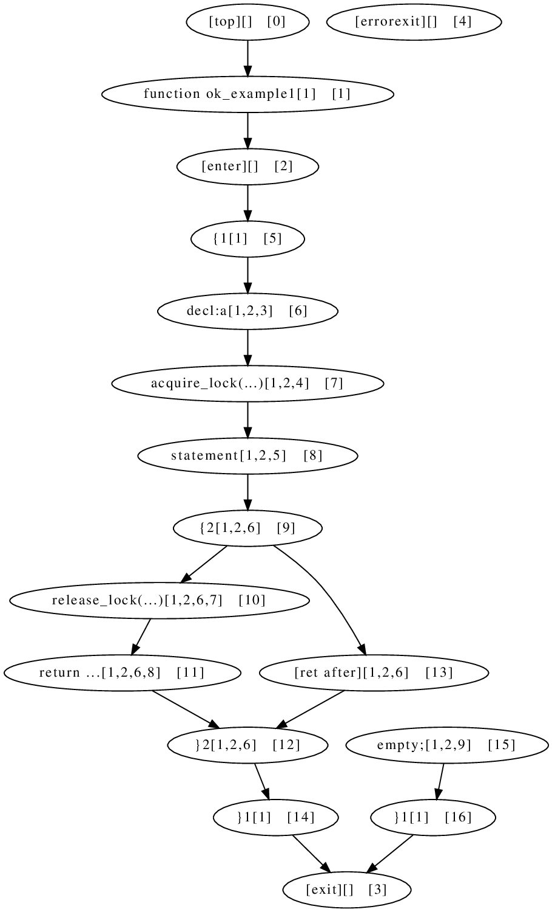

Simple macro expansion example that will throw "dead code" error...

# Setup

On Debian 11 just run:
```bash
sudo apt-get install coccinelle
# To see fow you need these X11 apps:
sudo apt-get install graphviz gv
```

Tested version:
```bash
$ dpkg -l coccinelle

Desired=Unknown/Install/Remove/Purge/Hold
| Status=Not/Inst/Conf-files/Unpacked/halF-conf/Half-inst/trig-aWait/Trig-pend
|/ Err?=(none)/Reinst-required (Status,Err: uppercase=bad)
||/ Name           Version       Architecture Description
+++-==============-=============-============-=================================
ii  coccinelle     1.1.0.deb-1.1 amd64        semantic patching tool for C

$  spatch --version

spatch version 1.1.0 compiled with OCaml version 4.11.1
Flags passed to the configure script: --prefix=/usr --sysconfdir=/etc --libdir=/usr/lib --enable-ocaml --enable-python --enable-opt
OCaml scripting support: yes
Python scripting support: yes
Syntax of regular expressions: PCRE
```

# How to reproduce

First checkout this project:

```bash
sudo apt-get install git
mkdir -p ~/projects
cd ~/projects
git clone https://github.com/hpaluch-pil/coccinelle-sandbox.git
cd cd coccinelle-sandbox/dead-code
```

And then run just:
```bash
./show_flow.sh

+ spatch --macro-file-builtins macros.h --control-flow simple1.c
init_defs_builtins: macros.h
FLOW: deadcode detected: File "simple1.c", line 7
+ exit 0
```

# How to dump flow with deadcode

We have to patch `spatch` (Coccinelle), we have to prepare source code using:

```bash
sudo apt-get install dpkg-dev ocaml-nox
sudo apt-get build-dep coccinelle
mkdir -p ~/src
cd ~/src
apt-get source coccinelle
cd coccinelle-1.1.0.deb/
```

Now apply this sloppy patch:
```diff
 x=parsing_c/test_parsing_c.ml
ansible@deb11-cocci:~/src/coccinelle-1.1.0.deb$ diff -u ~/clean-src/coccinelle-1.1.0.deb/$x $x
--- /home/ansible/clean-src/coccinelle-1.1.0.deb/parsing_c/test_parsing_c.ml	2021-02-24 14:52:51.000000000 +0100
+++ parsing_c/test_parsing_c.ml	2023-04-16 09:27:29.128000000 +0200
@@ -249,9 +249,10 @@
 	try
           let flow = Ast_to_flow.ast_to_control_flow e in
           flow +> do_option (fun flow ->
-            Ast_to_flow.deadcode_detection flow;
+            Printf.printf "Before X1\n";
+            (* HP Ast_to_flow.deadcode_detection flow; *)
+            Printf.printf "Before X2\n";
             let flow = Ast_to_flow.annotate_loop_nodes flow in
-
             let flow' =
 (*
               if !Flag_cocci.show_before_fixed_flow
```

Now build our patched version (we will also turn-on debugger support - just in case we will need it:
```bash
./autogen 
# EXTRA_OCAML_FLAGS is undocumented but required for debugging
./configure --disable-opt --prefix=/opt/cocci-debug EXTRA_OCAML_FLAGS=-g
make EXTRA_OCAML_FLAGS=-g
ls -lh spatch # the binary should be around 55MB in size, otherwise 
# there are not needed debug symbols
```

Now run again our modified version:
```bash
~/src/coccinelle-1.1.0.deb/spatch --macro-file-builtins macros.h --control-flow simple1.c

init_defs_builtins: macros.h
Before X1  # these must be printed - that you are using modified version
Before X2
```

If you have properly configured X11 support (you can use `ssh -Y my-coccinelle-machine`
to forward X11 session from remote host to your workstation with X11).

You should see chart similar to:



So now I at least understand why Coccinelle is unable to proceed with dead code - it
is impossible to process properly such chart with independent node that is not connected
to any flow...

Now we have last question - how and why was such dead-code generated?

TODO: ... 

# How to debug

Not used anymore - kept for reference.

How to debug and find full backtrace...
- https://ocaml.org/docs/debugging#printing-a-back-trace-for-an-uncaught-exception

TODO: ...

Install:

```bash
sudo apt-get install dpkg-dev ocaml-nox
sudo apt-get build-dep coccinelle
mkdir -p ~/src
cd ~/src
apt-get source coccinelle
cd coccinelle-1.1.0.deb/
./autogen 
# EXTRA_OCAML_FLAGS is undocumented but required for debugging
./configure --disable-opt --prefix=/opt/cocci-debug EXTRA_OCAML_FLAGS=-g
make EXTRA_OCAML_FLAGS=-g
ls -lh spatch # the binary should be around 55MB in size, otherwise 
# there are not needed debug symbols
```

And then:
```bash
cd ~/projects/coccinelle-sandbox/dead-code/
```
Verify that it still throws same error:
```bash
/opt/cocci-debug/bin/spatch --macro-file-builtins macros.h --control-flow simple1.c

init_defs_builtins: macros.h
FLOW: deadcode detected: File "simple1.c", line 7
```

Now try debugger
- see https://ocaml.org/docs/debugging#printing-a-back-trace-for-an-uncaught-exception

```bash
$ ocamldebug ~/src/coccinelle-1.1.0.deb/spatch --macro-file-builtins macros.h --control-flow simple1.c
	OCaml Debugger version 4.11.1

(ocd) r
Loading program... done.
# it may take several minutes before there is any program output
init_defs_builtins: macros.h
FLOW: deadcode detected: File "simple1.c", line 7
Time: 230701
Program exit.
(ocd) 
```

Hmm, we need to set proper break-point....
```
$ find ~/src/coccinelle-1.1.0.deb/ -name '*.ml' -exec fgrep -nH 'deadcode detected' {} \;

~/src/coccinelle-1.1.0.deb/parsing_c/control_flow_c_build.ml:1668:
	| None -> pr2 "FLOW: deadcode detected, but can't trace back the place"
~/src/coccinelle-1.1.0.deb/parsing_c/control_flow_c_build.ml:1670:
	    pr2 ("FLOW: deadcode detected: " ^ error_from_info info))
```

So now we have breakpoint candidates, let's try again:
```bash
$ ocamldebug ~/src/coccinelle-1.1.0.deb/spatch --macro-file-builtins macros.h --control-flow simple1.c
	OCaml Debugger version 4.11.1

(ocd) break @ control_flow_c_build 1668

Loading program... done.
# again it may take long time...
Breakpoint 1 at 0:4971080: file parsing_c/control_flow_c_build.ml, line 1668, characters 12-73

(ocd) break @ control_flow_c_build 1670

Breakpoint 2 at 0:4971036: file parsing_c/control_flow_c_build.ml, line 1670, characters 6-62

(ocd) info breakpoints

Num    Address  Where
  1 0:   4971080  file parsing_c/control_flow_c_build.ml, line 1668, characters 12-73
  2 0:   4971036  file parsing_c/control_flow_c_build.ml, line 1670, characters 6-62

(ocd) r
# again it may take long time...

init_defs_builtins: macros.h
Time: 230011 - pc: 0:4971036 - module Control_flow_c_build
Breakpoint: 2
1670 	    <|b|>pr2 ("FLOW: deadcode detected: " ^ error_from_info info))
(ocd) bt
Backtrace:
#0 Control_flow_c_build parsing_c/control_flow_c_build.ml:1670:6
#1 Stdlib__list list.ml:110:16
#2 Enter enter.ml:1697:7
#3 Enter enter.ml:1711:19
#4 Main main.ml:4:48
#5 Common commons/common.ml:1056:49
#6 Common commons/common.ml:166:15
#7 Common commons/common.ml:3533:10
#8 Main main.ml:2:3

(ocd) frame
#0 Control_flow_c_build parsing_c/control_flow_c_build.ml:1670:6
Breakpoint: 2
1670 	    <|b|>pr2 ("FLOW: deadcode detected: " ^ error_from_info info))

# you can use "list" command to see source list

(ocd) print error
error: error =
  DeadCode
   (Some {str = ";"; charpos = 93; line = 7; column = 15; file = "simple1.c"})

(ocd) b
Time: 230009 - pc: 0:4970912 - module Control_flow_c_build
1665     <|b|>match error with

(ocd) b
Time: 230008 - pc: 0:4970896 - module Control_flow_c_build
1663     <|b|>let error_from_info info =

(ocd) b
Time: 230007 - pc: 0:4970872 - module Control_flow_c_build
1661   <|b|>if !Flag_parsing_c.verbose_cfg

(ocd) b
Time: 230006 - pc: 0:5678216 - module Test_parsing_c
271         with Ast_to_flow.Error (x) -> <|b|>Ast_to_flow.report_error x

(ocd) print x
x: Ast_to_flow.error =
  Ast_to_flow.DeadCode
   (Some {str = ";"; charpos = 93; line = 7; column = 15; file = "simple1.c"})

(ocd) b
Time: 230005 - pc: 0:4973284 - module Control_flow_c_build
1579 		Some info -> raise (Error (DeadCode (Some info)))<|a|>

(ocd) print ii
ii: Ast_c.il =
  [{pinfo =
     OriginTok
      {str = ";"; charpos = 93; line = 7; column = 15; file = "simple1.c"};
    cocci_tag = {contents = None};
    comments_tag =
     {contents = {mbefore = []; mafter = []; mbefore2 = []; mafter2 = []}};
    annots_tag = <abstr>; danger = {contents = NoDanger}}]

ocd) print st
st: Ast_c.statement =
  (Ast_c.ExprStatement None,
   [{pinfo =
      OriginTok
       {str = ";"; charpos = 93; line = 7; column = 15; file = "simple1.c"};
     cocci_tag = {contents = None};
     comments_tag =
      {contents = {mbefore = []; mafter = []; mbefore2 = []; mafter2 = []}};
     annots_tag = <abstr>; danger = {contents = NoDanger}}])

ocd) list
1569       | TopNode -> ()
1570       | FunHeader _ -> ()
1571       | ErrorExit -> ()
1572       | Exit -> ()     (* if have 'loop: if(x) return; i++; goto loop' *)
1573       | SeqEnd _ -> () (* todo?: certaines '}' deviennent orphelins *)
1574       | x ->
1575           (match Control_flow_c.extract_fullstatement node with
1576           | Some st ->
1577 	      let ii = Ast_c.get_ii_st_take_care st in
1578 	      (match safe_pinfo_of_ii ii with
1579 		Some info -> raise (Error (DeadCode (Some info)))<|a|>
1580 	      | None ->
1581 		  let ii = Lib_parsing_c.ii_of_stmt st in
1582 		  raise (Error (DeadCode (safe_pinfo_of_ii ii))))
1583           | _ -> pr2 "CFG: orphan nodes, maybe something weird happened"
1584           )
1585       )
1586   ) g#nodes

(ocd) print node
node: Control_flow_c.node =
  ((ExprStatement
     ((Ast_c.ExprStatement None,
       [{pinfo =
          OriginTok
           {str = ";"; charpos = 93; line = 7; column = 15;
            file = "simple1.c"};
         cocci_tag = {contents = None};
         comments_tag =
          {contents =
            {mbefore = []; mafter = []; mbefore2 = []; mafter2 = []}};
         annots_tag = <abstr>; danger = {contents = NoDanger}}]),
     (None,
      [{pinfo =
         OriginTok
          {str = ";"; charpos = 93; line = 7; column = 15;
           file = "simple1.c"};
        cocci_tag = {contents = None};
        comments_tag =
         {contents = {mbefore = []; mafter = []; mbefore2 = []; mafter2 = []}};
        annots_tag = <abstr>; danger = {contents = NoDanger}}])),
    {Control_flow_c.labels = [1; 2; 9]; bclabels = []; is_loop = false;
     is_fake = false}),
   "empty;[1,2,9]")


...

(ocd) b
Time: 229999 - pc: 0:4973224 - module Control_flow_c_build
1578 	      <|b|>(match safe_pinfo_of_ii ii with
```

Trygin again - finding where DeadCode is raised:
```bash
$ ocamldebug ~/src/coccinelle-1.1.0.deb/spatch --macro-file-builtins macros.h --control-flow simple1.c
	OCaml Debugger version 4.11.1

(ocd) break @ control_flow_c_build 1579

Loading program... done.
Breakpoint 1 at 0:4973256: file parsing_c/control_flow_c_build.ml, line 1579, characters 16-52

(ocd) break @ control_flow_c_build 1582

Breakpoint 2 at 0:4973308: file parsing_c/control_flow_c_build.ml, line 1581, characters 14-41

(ocd) r
# now it may take several minutes

nit_defs_builtins: macros.h
Time: 230004 - pc: 0:4973256 - module Control_flow_c_build
Breakpoint: 1
1579 		Some info -> <|b|>raise (Error (DeadCode (Some info)))

(ocd) bt
Backtrace:
#0 Control_flow_c_build parsing_c/control_flow_c_build.ml:1579:16
#1 Stdlib__map map.ml:296:26
#2 Test_parsing_c parsing_c/test_parsing_c.ml:252:48
#3 Test_parsing_c parsing_c/test_parsing_c.ml:270:12
#4 Stdlib__list list.ml:110:16
#5 Enter enter.ml:1697:7
#6 Enter enter.ml:1711:19
#7 Main main.ml:4:48
#8 Common commons/common.ml:1056:49
#9 Common commons/common.ml:166:15
#10 Common commons/common.ml:3533:10
#11 Main main.ml:2:3

(ocd) list

... source listing ...

(ocd) print info
info: Common.parse_info =
  {str = ";"; charpos = 93; line = 7; column = 15; file = "simple1.c"}

(ocd) print g
g: Control_flow_c.cflow = <obj>

(ocd) print node
node: Control_flow_c.node =
  ((ExprStatement
     ((Ast_c.ExprStatement None,
       [{pinfo =
          OriginTok
           {str = ";"; charpos = 93; line = 7; column = 15;
            file = "simple1.c"};
         cocci_tag = {contents = None};
         comments_tag =
          {contents =
            {mbefore = []; mafter = []; mbefore2 = []; mafter2 = []}};
         annots_tag = <abstr>; danger = {contents = NoDanger}}]),
     (None,
      [{pinfo =
         OriginTok
          {str = ";"; charpos = 93; line = 7; column = 15;
           file = "simple1.c"};
        cocci_tag = {contents = None};
        comments_tag =
         {contents = {mbefore = []; mafter = []; mbefore2 = []; mafter2 = []}};
        annots_tag = <abstr>; danger = {contents = NoDanger}}])),
    {Control_flow_c.labels = [1; 2; 9]; bclabels = []; is_loop = false;
     is_fake = false}),
   "empty;[1,2,9]")

```


